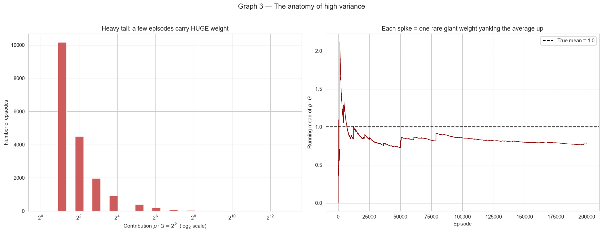
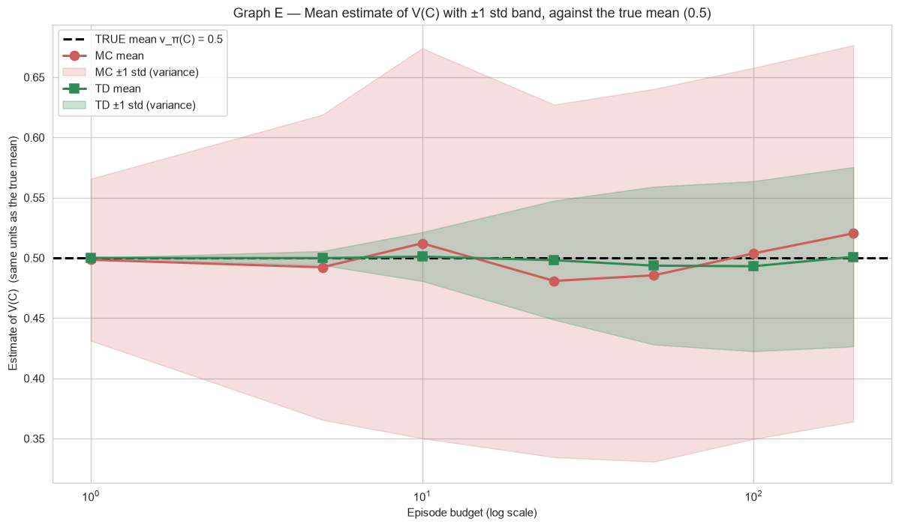
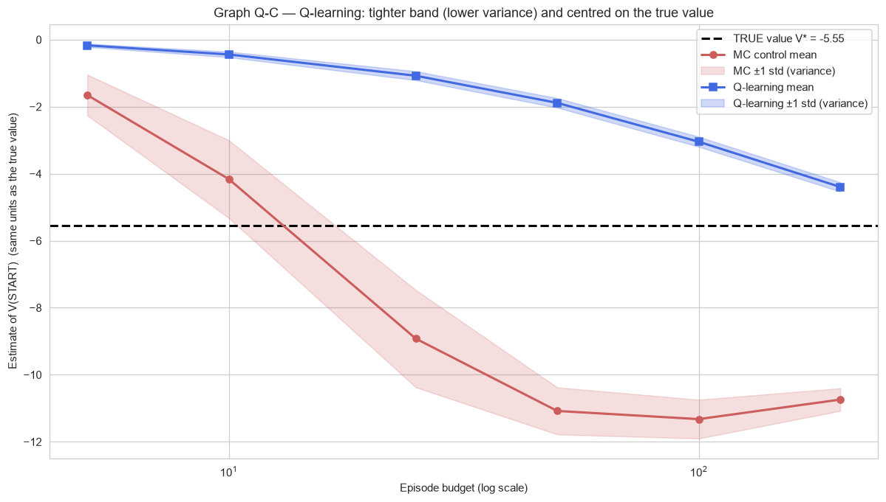

# Taming Variance in Model-Free Reinforcement Learning

Three connected in-class experiments (CSCN8020 — Reinforcement Learning) that tell a
single story: **when an agent learns only from sampled experience, its value
estimates can swing wildly from run to run — and there are clean, well-known ways to
calm that "variance" down.** Each experiment has a *known correct answer*, so the
jumpiness can actually be measured and plotted against the truth.

> The intuition and analogies below are borrowed from my study guide
> `TeachMuthu_MC_RLP.md` (the Anu / Bala / Rolo "Frozen Lake Village" story).

---

## The three exercises

### 1 · Off-Policy Monte Carlo with Importance Sampling — *the variance monster*
**Notebook:** [`notebooks/Off_Policy_Importance_Sampling.ipynb`](notebooks/Off_Policy_Importance_Sampling.ipynb)

You can learn about one plan (the **target**) while following another (a random
**behavior** policy) by re-weighting what you saw — "how likely would *my* plan have
made that same move?". But those weights get **multiplied** step after step, so once
in a while a single lucky run earns a giant weight and yanks the whole average.

On Sutton & Barto's one-state "infinite variance" world (true value = **1.0**) the
plain ("ordinary") estimator literally has **infinite variance** — more data never
fixes it — while the self-normalising ("weighted") estimator trades a pinch of bias
for a calm, correct answer.



### 2 · Tabular TD(0) — *bootstrapping as the cure*
**Notebook:** [`notebooks/Tabular_TD0_Variance_Mitigation.ipynb`](notebooks/Tabular_TD0_Variance_Mitigation.ipynb)

Monte Carlo waits for the **whole episode** to finish and updates toward the full
(noisy) return. **TD(0)** instead nudges its guess a little at *every step* using its
own next guess — "don't wait until you get home to fix your time estimate; fix it at
each checkpoint." That single change (called **bootstrapping**) means each update only
absorbs *one* step of randomness, so it is far steadier.

On the 5-state random walk (true middle value = **0.5**) TD's estimate band is much
thinner than MC's and still lands on the truth.



### 3 · Q-learning — *off-policy TD control* (+ an optimized step function)
**Notebook:** [`notebooks/Exercise3_QLearning.ipynb`](notebooks/Exercise3_QLearning.ipynb)

Q-learning takes the step-by-step idea all the way to **control** (finding the *best*
plan). Its one new ingredient is the **`max`** over next-state actions, which lets it
learn the value of the greedy/optimal policy *while* exploring — so it isn't dragged
down by its own random exploration (the classic Cliff-Walking effect).

On a slippery grid (true start value ≈ **−5.5**) Q-learning is both **steadier** and
**more accurate** than Monte Carlo control. The notebook also **optimizes the update
for large problems** (`S > 100`, `A > 100`): writing `maxₐ Q(S',a)` as a vectorized
NumPy call instead of a Python loop gives identical results but up to **~20× faster**.



---

## The one-paragraph takeaway

It's the same lesson three times: leaning on your own running guess (TD, Q-learning)
or self-normalising your weights (weighted importance sampling) trades a tiny bit of
bias for a **big** drop in variance. On a limited number of runs, the calmer method
wins — and this trade is the beating heart of SARSA, Q-learning, and the deep-RL
agents (DQN) that learn to play games.

A plain-English write-up of all three is in **[`docs/Report.md`](docs/Report.md)**
(and [`docs/Report.pdf`](docs/Report.pdf)).

---

## Repository layout

```
.
├── README.md
├── requirements.txt
├── notebooks/                         # the three runnable, fully-executed exercises
│   ├── Off_Policy_Importance_Sampling.ipynb      (Exercise #1)
│   ├── Tabular_TD0_Variance_Mitigation.ipynb     (Exercise #2)
│   └── Exercise3_QLearning.ipynb                 (Exercise #3)
├── scripts/                           # reproducibility helpers
│   ├── build_notebook.py              # regenerates the Exercise #1 notebook
│   ├── build_td0_notebook.py          # regenerates the Exercise #2 notebook
│   ├── build_qlearning_notebook.py    # regenerates the Exercise #3 notebook
│   └── make_pdf.py                    # docs/Report.md  ->  docs/Report.pdf
└── docs/
    ├── Report.md  /  Report.pdf       # the plain-language report
    ├── images/                        # graphs the report embeds
    └── slides/                        # original class slides / source PDFs
```

---

## How to run

```bash
# 1. Create a virtual environment and install dependencies
python -m venv .venv
.venv/Scripts/activate        # Windows  (use: source .venv/bin/activate on macOS/Linux)
pip install -r requirements.txt

# 2. Open any notebook and run top-to-bottom
jupyter lab notebooks/

# (optional) regenerate a notebook from its build script:
python scripts/build_qlearning_notebook.py
python -m nbconvert --to notebook --execute --inplace notebooks/Exercise3_QLearning.ipynb

# (optional) rebuild the PDF report from the Markdown:
python scripts/make_pdf.py
```

---

## Further study (videos that match these exercises)

- **David Silver — RL Course, Lecture 4: Model-Free Prediction** — Monte Carlo and
  TD, incl. the random walk: https://www.youtube.com/watch?v=PnHCvfgC_ZA
- **David Silver — RL Course, Lecture 5: Model-Free Control** — on/off-policy control,
  Sarsa vs Q-learning: https://www.youtube.com/watch?v=0g4j2k_Ggc4
- **Steve Brunton — Q-Learning & Temporal Difference Learning** — short, intuition
  first: https://www.youtube.com/watch?v=0iqz4tcKN58

*(Based on Sutton & Barto, *Reinforcement Learning: An Introduction*, Chapters 5–6.)*
